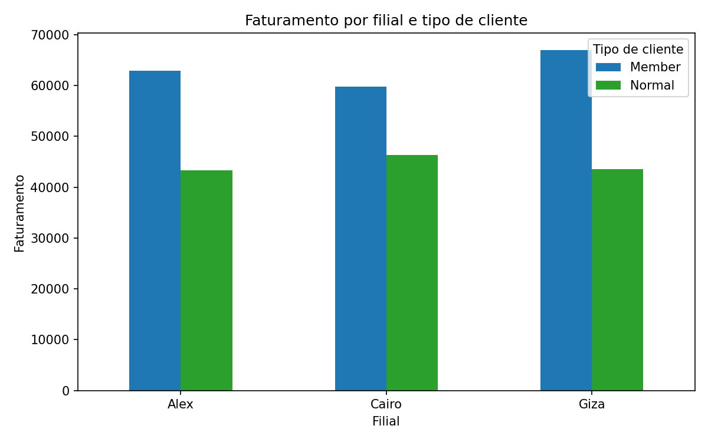
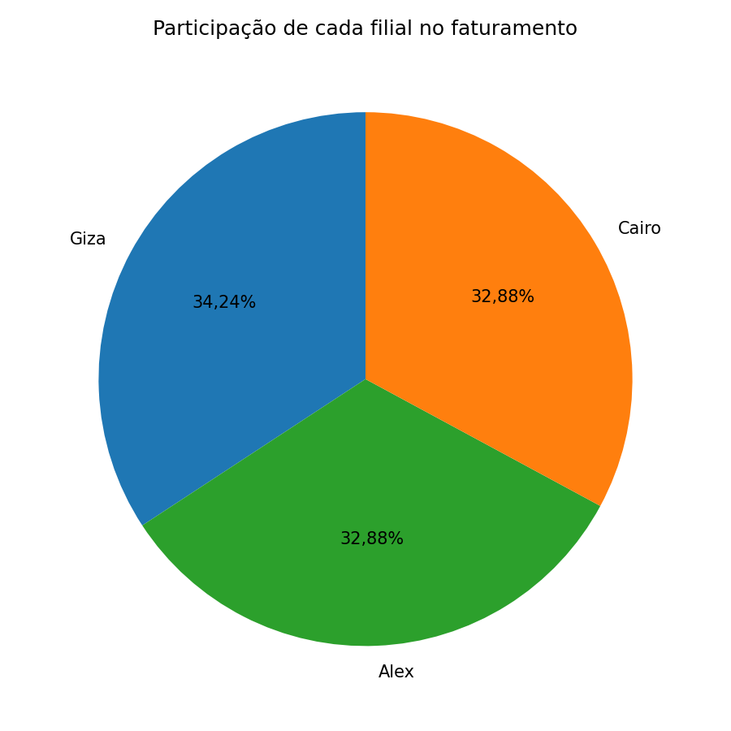
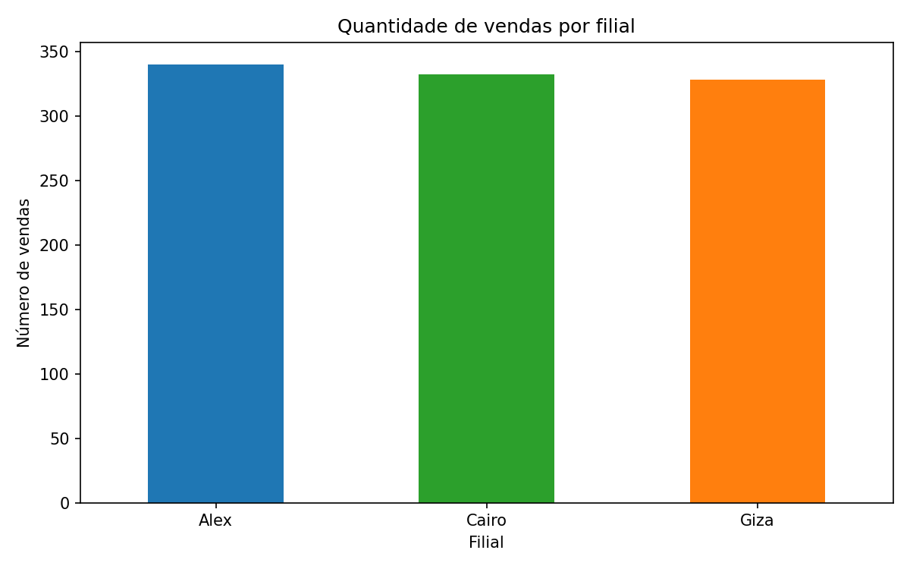
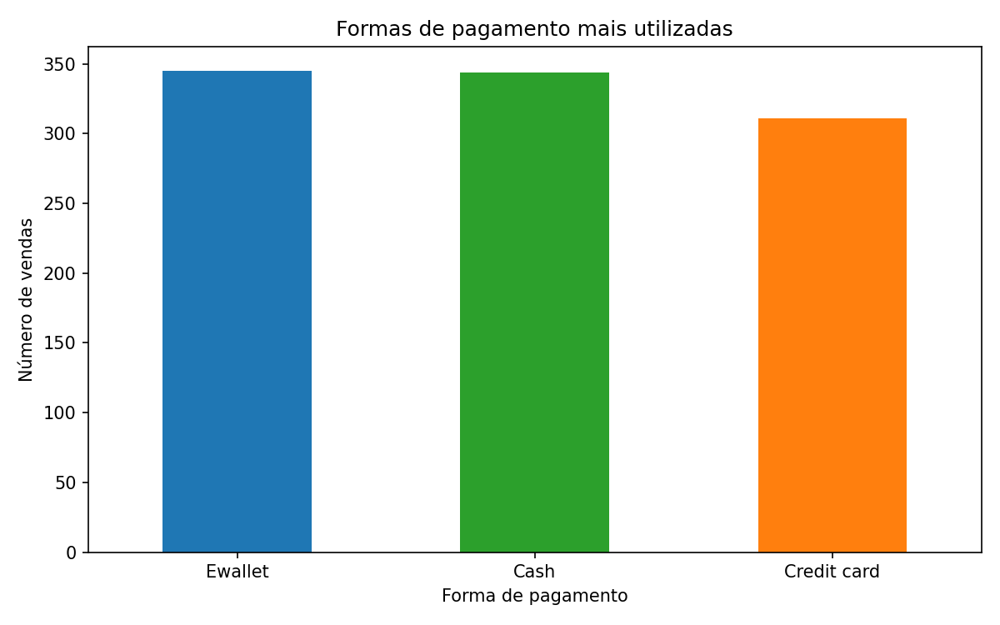

# Projeto Avaliativo ETL - Supermarket Sales

**Francielle G. Souza - Análise de Dados T3**

## Sobre o Projeto

O projeto tem o objetivo de criar um pipeline de dados em Python e PostgreSQL inspirado na Arquitetura Medallion, em versão simplificada (apenas Raw e Tratada). Utiliza dados de uma rede de supermercados para responder perguntas de negócio e gerar insights.

Fonte: [Supermarket Sales (Kaggle)](https://www.kaggle.com/datasets/faresashraf1001/supermarket-sales)

## Tecnologias

* Python 3.10.12 (64-bit)
* Pandas, SQLAlchemy, psycopg2-binary, python-dotenv, matplotlib
* PostgreSQL

## Estrutura do Projeto

```
Projeto_ETL_Supermarket_Francielle_T3/
│
├── data/
│   ├── raw/                          # base de dados original, sem alterações
│   └── processed/                      # csv com os dados limpos e tratados
│
├── sql/
│   ├── 01_criar_banco.sql         # cria o banco de dados
│   ├── 02_criar_tabelas.sql       # cria tabelas raw_vendas e vendas_tratadas
│   └── 03_consultas.sql           # consultas de validação
│
├── src/
│   ├── 00_carga_raw_vendas.py           # carrega dados originais na raw_vendas
│   ├── 01_leitura_dados.py              # faz leitura e inspeção dos dados
│   ├── 02_etl_vendas.py                 # aplica processo de ETL
│   ├── 03_estatistica.py                # faz análise estatística
│   ├── conexao.py                       # conexão com o banco de dados PostgreSQL
│   └── run_etl.py                       # arquivo que orquestra o pipeline
│
├── resultados/                          # armazena os resultados
│   ├── estatisticas/
│   │   └── metricas_analise.csv
│   │
│   └── graficos/
│       ├── faturamento_filial_tipo_cliente.png
│       ├── participacao_filial_faturamento.png
│       ├── faturamento_por_linha.png
│       ├── vendas_por_filial.png
│       └── formas_pagamento.png
│
├── .env
├── .gitignore
├── README.md
└── requirements.txt
```

## Arquitetura do Projeto

CSV original **→** raw_vendas (PostgreSQL) **→** ETL (PostgreSQL + Pandas) **→** vendas_tratadas (PostgreSQL + CSV) **→** resultados (estatísticas e gráficos)

**Camadas:**

* **Raw (raw_vendas):** dados originais do CSV, mais uma coluna de controle interno (id_raw).
* **Tratada (vendas_tratadas):** dados com nomes em português, tipos corretos, colunas derivadas e restrições de integridade.

**Tratamentos aplicados (02_etl_vendas.py):**

* Remoção da coluna de controle id_raw.
* Renomeação das 17 colunas para português, em minúsculo e sem acento (ex.: branch -> filial, total -> valor_total).
* Remoção de espaços extras nas colunas de texto.
* Conversão de tipos: valores numéricos para decimal, quantidade para inteiro, data_venda para data (formato original mês/dia/ano) e hora_venda para hora.
* Criação de colunas derivadas para apoiar a análise: dia_semana e nome_mes.
* Nulos e duplicados: a inspeção não encontrou nenhum dos dois, e a função validar repete essa checagem após as conversões, removendo id_venda duplicado antes da carga.
* Carga: a tabela vendas_tratadas é esvaziada (TRUNCATE) e recebe os dados novamente, o que evita duplicar registros ao rodar pipeline mais de uma vez. A base também é salva em data/processed/vendas_tratadas.csv.

## Dicionário de Dados (camada tratada)

|      Coluna      |        Tipo        | Restrições       | Descrição                                   |
| :---------------: | :----------------: | ------------------ | --------------------------------------------- |
|     id_venda     |    VARCHAR (50)    | PK, NOT NULL       | Identificador da venda (original: invoice_id) |
|      filial      |    VARCHAR(10)    | NOT NULL           | Filial onde ocorreu a venda                   |
|      cidade      | VARCHAR<br />(100) | NOT NULL           | Cidade da filial                              |
|   tipo_cliente   |    VARCHAR(50)    |                    | Tipo de cliente                               |
|      genero      |    VARCHAR(20)    |                    | Gênero do cliente                            |
|   linha_produto   |    VARCHAR(150)    | NOT NULL           | Linha de produto vendida                      |
|  preco_unitario  |   NUMERIC(10,2)   | CHECK >= 0         | Preço unitário                              |
|    quantidade    |      INTEGER      | CHECK > 0          | Quantidade vendida                            |
|      imposto      |   NUMERIC(10,2)   | CHECK >= 0         | Imposto de 5% (original: tax_5)               |
|    valor_total    |   NUMERIC(12,2)   | CHECK >= 0         | Valor total da venda, com imposto             |
|    data_venda    |        DATE        |                    | Data da venda                                 |
|    hora_venda    |        TIME        |                    | Hora da venda                                 |
|  forma_pagamento  |    VARCHAR(50)    | NOT NULL           | Forma de pagamento                            |
| custo_mercadoria |   NUMERIC(12,2)   | CHECK >= 0         | Custo da mercadoria vendida (original: cogs)  |
| margem_percentual |   NUMERIC(10,2)   |                    | Margem bruta percentual                       |
|   receita_bruta   |   NUMERIC(12,2)   | CHECK >= 0         | Receita bruta (original: gross_income)        |
|     avaliacao     |    NUMERIC(4,2)    | CHECK entre 0 e 10 | Avaliação do cliente (original: rating)     |
|    dia_semana    |    VARCHAR(20)    |                    | dia da semana da venda (derivada)             |
|     nome_mes     |    VARCHAR(20)    |                    | nome do mês (derivada)                       |

## Como Executar

**Pré-requisitos**

* Python e PostgreSQL instalados
* Git

**Passo a Passo**

1. Clonar o repositório e instalar as dependências: pip install -r requirements.txt
2. Criar o banco no PostgreSQL executando sql/01_criar_banco.sql (conectado ao banco postgres).
3. Criar as tabelas executando sql/02_criar_tabelas.sql (conectado ao banco supermarket_vendas).
4. Criar o arquivo .env na raiz do projeto com as credenciais do banco (USUARIO, SENHA, HOST, PORTA, BANCO). O .env não é versionado.
5. Rodar o pipeline completo, a partir da raiz do projeto: python src/run_etl.py
6. Rodar as consultas de validação de sql/03_consultas.sql para conferir os dados carregados.

## Decisões

* A carga da camada Tratada usa TRUNCATE seguido de inserção, o que torna o pipeline reexecutável sem duplicar dados.
* O orquestrador run_etl.py é uma automação simples, sem agendamento. Uma evolução possível seria usar uma ferramenta de orquestração como o Apache Airflow.
* Como a base é pequena (1.000 registros) e não tinha nulos nem duplicados, o tratamento dos dados foi enxuto: após as conversões, a função validar confere a quantidade de nulos e de id_venda duplicados e remove duplicidades antes da carga.

## Resultados e Insights

* **Perfil dos clientes:** predominância de clientes do tipo  **Member**, com destaque para a filial Giza.
* **Filial com maior faturamento:** **Giza**, com faturamento de  **R$ 110.568,71** , sendo a maioria das vendas realizadas para clientes Member.
* **Filial com maior volume de vendas:** **Alex** , com **340 vendas** registradas.
* **Linha de produto com maior faturamento:** **Food and Beverages** , responsável por **R$ 56.144,84** em faturamento.
* **Melhor avaliação média:** **Food and Beverages** , com média de  **7,11** .
* **Forma de pagamento mais utilizada:** **Ewallet** , utilizada em  **345 vendas** .
* **Valor médio por venda:** **R$ 322,97** .
* **Maior venda registrada:** **R$ 1.042,65** .
* **Dia da semana com maior volume de vendas:** **sábado** , com  **164 vendas** .
* **O preço unitário médio foi de 55,67 e o mês com maior faturamento foi Janeiro.**

**Gráficos:** 










